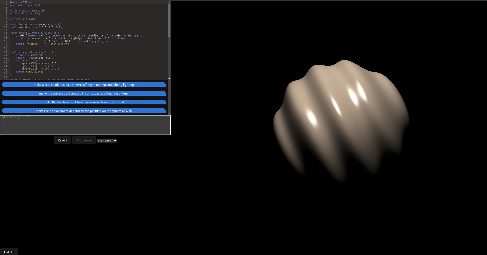

# LLM Shader Toy

This is a simple web app that allows you to write and run simple GLSL shaders in the browser with the help of an LLM.



## Supported Features

TODO: supported / non supported shader features, e.g. textures, available uniforms etc.

## Develop

```bash
npm install
npm run dev
```

## Publish

```bash
gh release create <vX.Y.Z>
```
